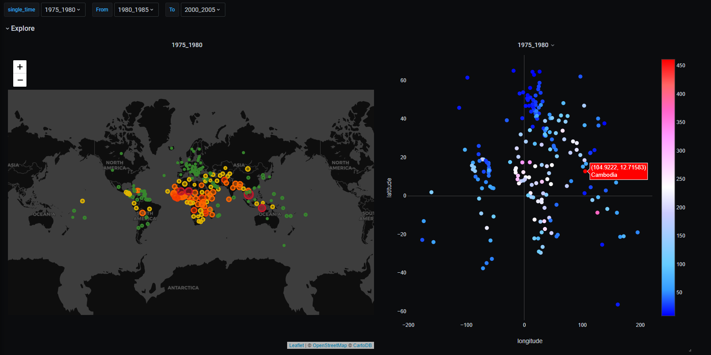
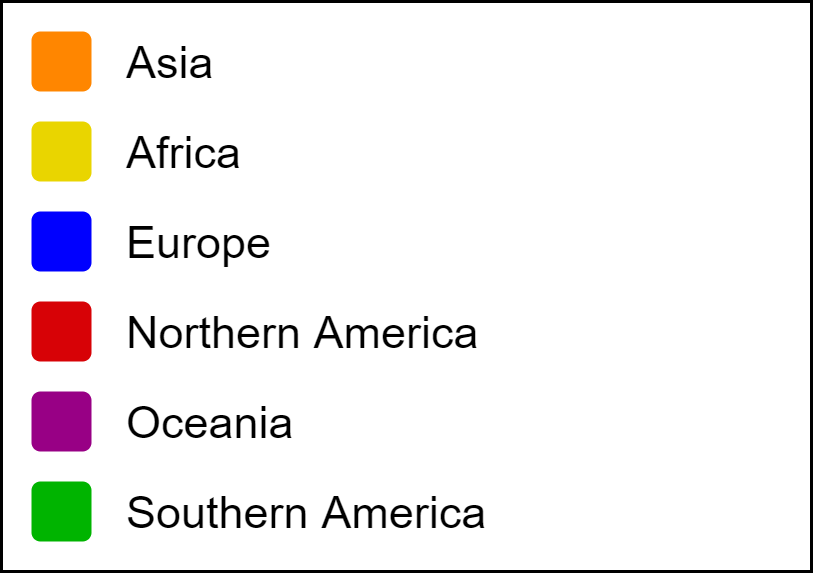
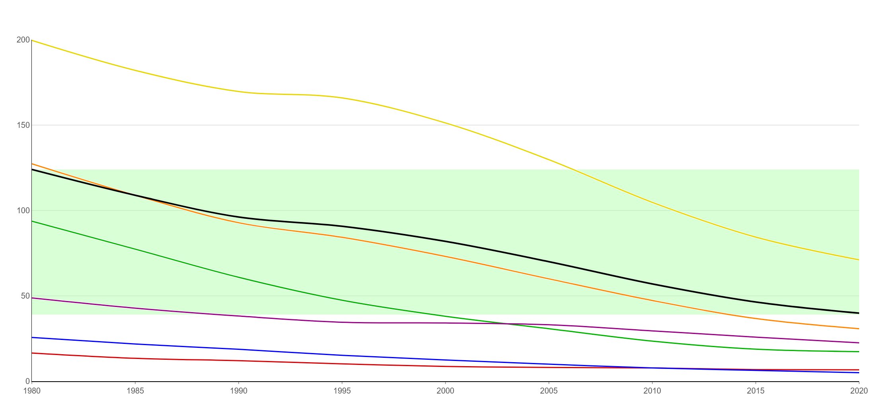
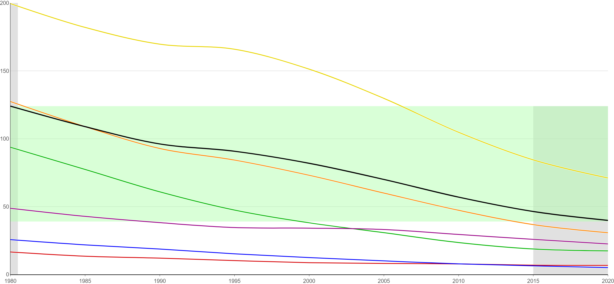
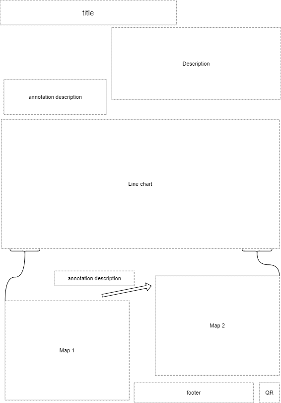

# InfVis Module Task

*Timeo Wullschleger*

*02.12.2020*

*MSE - module InfVis*

*Module supervisor: Prof. Dr. Susanne Bleisch*

## Summary

**U5MR** stands for Under 5 Mortality Rate. Typically, an U5MR value describes the number of children who died before the age of Fife years. Children, especially at a young age, are the most vulnerable part of a society. Using the mortality rate at an age under five years, the wealth of a country or a continent can be described. In the past 20 years, the worldwide U5MR was halved. Most people think, that the world is getting worse but it is not. The goal is to show the global increase of wealth.

Tools & libraries used

Data exploration and preparation
* Docker
* Grafana
* PostgreSQL
* Google sheets

Vizualisation
* Python
* Plotly
* PowerPoint

## Dataset


UNdata provides multiple datasets with U5MR data.
[This](http://data.un.org/Data.aspx?q=under+five+mortality&d=PopDiv&f=variableID%3a80) dataset contains five-year averaged data from 1950 to 2020 and projected data from 2020 to 2100. It is the biggest dataset and contains data of every country with more than 90'000 inhabitants (in 2019). Next to the countries, it also contains the worldwide average and averages of continents and regions.

Where UNdata got each values can be seen [here](https://population.un.org/wpp/DataSources/). The dataset was downloaded as `.csv`.

Because we do not know what will happen in the future, i have limited the used values to the historical values.


The first dataset has the following structure:
```csv
      Country or Area Code Country or Area    Year(s) Variant    Value
0                        4     Afghanistan  2095-2100  Medium   12.133
1                        4     Afghanistan  2090-2095  Medium   13.109
2                        4     Afghanistan  2085-2090  Medium   14.154
3                        4     Afghanistan  2080-2085  Medium   15.389
4                        4     Afghanistan  2075-2080  Medium   16.669
...                    ...             ...        ...     ...      ...
8665                   716        Zimbabwe  1970-1975  Medium  111.207
8666                   716        Zimbabwe  1965-1970  Medium  119.019
8667                   716        Zimbabwe  1960-1965  Medium  138.869
8668                   716        Zimbabwe  1955-1960  Medium  160.934
8669                   716        Zimbabwe  1950-1955  Medium  181.452 
```
I was able to download the same dataset as an excel sheet `UnderFiveMortality5q0SustDevGroups.xlsx` grouped by regions from [here](https://population.un.org/PEPxplorer/api/queryweb/exportexcel). 
>Unfortunately, their website has changed and the data selector tool does not work anymore.

The second dataset has following structure:

```
     ISO 3166-1 numeric code                                    Location  ... 2010 - 2015 2015 - 2020
0                        900                                       World  ...         NaN         NaN
1                       1828  Sustainable Development Goal (SDG) regions  ...         NaN         NaN
2                        947                          Sub-Saharan Africa  ...        93.0        78.0
3                        910                              Eastern Africa  ...        73.0        60.0
4                        108                                     Burundi  ...        78.0        63.0
..                       ...                                         ...  ...         ...         ...
228                      528                                 Netherlands  ...         4.0         3.0
229                      756                                 Switzerland  ...         4.0         4.0
230                      918                            Northern America  ...         7.0         7.0
231                      124                                      Canada  ...         5.0         5.0
232                      840                    United States of America  ...         7.0         7.0
```

Both datasets include the `ISO 3166-1 code` for each country.

## Preparing the data

The dataset only contains data of countries with more than 90 000 inhabitants in 2019. However, some countries with less than 90 000 inhabitants are listed too so they had to be removed. This was done manually.

### Adding latitude and longitude to the countries

To create a visualization with geographical informations, latitude and longitude are needed.
The python library [hdx](https://pypi.org/project/hdx-python-country/) was used to get additional information for each country.

This snippet shows how it was done (Afghanistan as example):

```py
>>> from hdx.location.country import Country
>>> Country.get_country_info_from_m49(4)
```
The result of this command is a dict

```json
{
    "#meta+id": "1",
    "#country+code+v_hrinfo_country": "181",
    "#country+code+v_reliefweb": "13",
    "#country+code+num+v_m49": "4",
    "#country+code+v_fts": "1",
    "#country+code+v_iso2": "AF",
    "#country+code+v_iso3": "AFG",
    "#country+name+preferred": "Afghanistan",
    "#country+alt+name+v_m49": "",
    "#country+alt+name+v_iso": "",
    "#country+alt+name+v_unterm": "",
    "#country+alt+name+v_fts": "",
    "#country+alt+name+v_hrinfo_country": "",
    "#country+name+short+v_reliefweb": "",
    "#country+alt+name+v_reliefweb": "",
    "#country+alt+i_en+name+v_unterm": "Afghanistan",
    "#country+alt+i_fr+name+v_unterm": "\"Afghanistan (l\") [masc.]\"",
    "#country+alt+i_es+name+v_unterm": "Afganistán (el)",
    "#country+alt+i_ru+name+v_unterm": "Афганистан",
    "#country+alt+i_zh+name+v_unterm": "阿富汗",
    "#country+alt+i_ar+name+v_unterm": "أفغانستان",
    "#geo+admin_level": "0",
    "#geo+lat": "33.83147477",
    "#geo+lon": "66.02621828",
    "#region+code+main": "142",
    "#region+main+name+preferred": "Asia",
    "#region+code+sub": "34",
    "#region+name+preferred+sub": "Southern Asia",
    "#region+code+intermediate": "",
    "#region+intermediate+name+preferred": "",
    "#country+regex": "afghan"
}
```

Following metadata was appended to the dataset:

name|key|example value from above
-|-|-
Latitude|`#geo+lat`|33.83147477
Longitude|`#geo+lon`|66.02621828
Continent|`#region+main+name+preferred`|Asia
Region in continent|`#region+name+preferred+sub`|Southern Asia

This was done for each country in both files.


### Getting to know the data

To explore the data, i used Grafana and a PostgreSQL database. To have a simple setup, i used docker-compose. 
[The docker-compose file is here](docker/docker-compose.yml). 

To import the data into the db, i created a table `countries` and imported the [dataset](docker/infvis/data/wlatlong.csv):
```sql
CREATE TABLE "countries" (
    "ISO_code" integer,
    "Location" text,
    "1950_1955" integer,
    "1955_1960" integer,
    "1960_1965" integer,
    "1965_1970" integer,
    "1970_1975" integer,
    "1975_1980" integer,
    "1980_1985" integer,
    "1985_1990" integer,
    "1990_1995" integer,
    "1995_2000" integer,
    "2000_2005" integer,
    "2005_2010" integer,
    "2010_2015" integer,
    "2015_2020" integer,
    "region" text,
    "continent" text,
    "latitude" double precision,
    "longitude" double precision
);
```

```sql
\copy countries FROM '/home/files/wlatlong.csv' DELIMITER ',' CSV HEADER;
```

In Grafana, i created a dashboard to analyze the values in relation to the geographic location.

Between 1975 and 1980, Cambodia was significantly higher than the other countries.



The average of the years from 1990 to 1995 indicated that something happend in Rwanda:


To compare the values of different times, another section was added:


## Visualization 1

In the first vizualisation, the goal is to show how the u5mr values have decreased over the last 40 years. The data was categorized in the continents.

### Colors

many people associate continents with colors. An example is the olympic rings (although the colors were not officially chosen for that reason). While doing research about this, i came accross this [Reddit post](https://www.reddit.com/r/MapPorn/comments/ajlphq/poll_results_what_color_is_each_continent/), where the user made a survey about this. 

The result can be seen below:


To find the suitable color palette, i made use of [VIZ PALETTE](https://projects.susielu.com/viz-palette) and adjusted the colors:


The resulting colors for the continents are:

color name|rgb value|continent
-|-|-
orange|`rgb(255,134,0)`|Asia
gold|`rgb(233,213,0)`|Africa
red|`rgb(215,2,6)`|Northern America
indigo|`rgb(0,0,255)`|Europe
green|`rgb(0,180,0)`|Southern America
magenta|`rgb(152,0,133)`|Oceania




### Type of plot

To indicate the change over time of the rate in each continent, a line chart with not more than the important data was used.


### Anotations & Highlighting

In this plot, i want to show that the global U5MR has decreased. I added a green rectangle to highlight the change:




Under this plot, there will be two map plots. They are referencing the years `1975-1980` and `2015-2020`. To indicate the relation, two gray rectangles were added:




>The genocide in Rwanda, 1994, had an influence to Africa's average. An annotation will be added for this.


## Plot 2
Geographig distribution and change over time

## Layout of the info graphic


